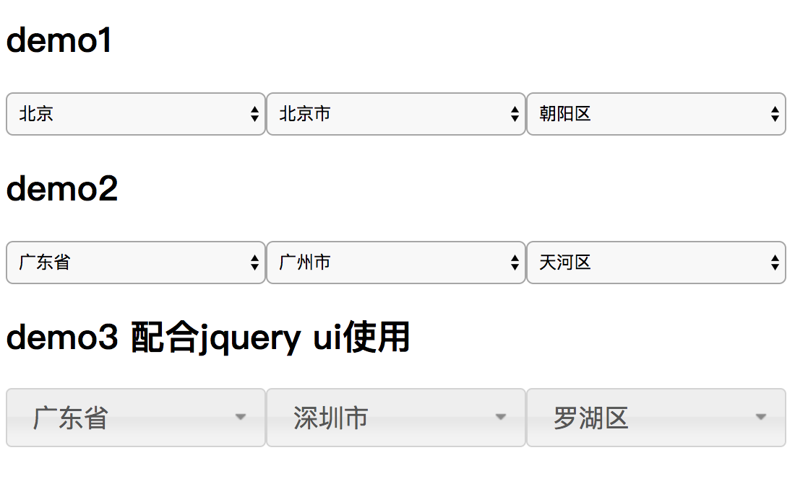

# jQuery 多级联动下拉框插件

##  使用示例

```
<script src="//code.jquery.com/jquery-1.10.2.js"></script>
<script src="jquery-chain-select.js"></script>
    
<span id="js-chain-demo1"></span>

<script>

    $(function () {
        $("#js-chain-demo1").chainSelect({

            //设置ajax获取下拉选项数据的url
            //接收pid参数，根据pid参数(父级id)返回json数据
            //服务端端回数据示例： [{"id":"12","name":"北京"},{"id":"13","name":"广东省"}]

            optionData: "jquery-chain-select.php", 
            items: [
                {name: 'province', selected: "13", prompt: '--选择省--'},
                {name: 'city', selected: "41", prompt: '--选择市--'},
                {name: 'county', selected: "52", prompt: '--选择区县--'},
            ]
        })
    });
</script>

```


